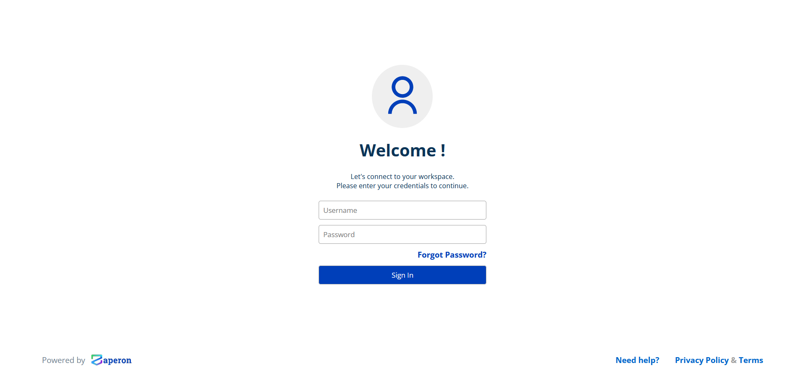
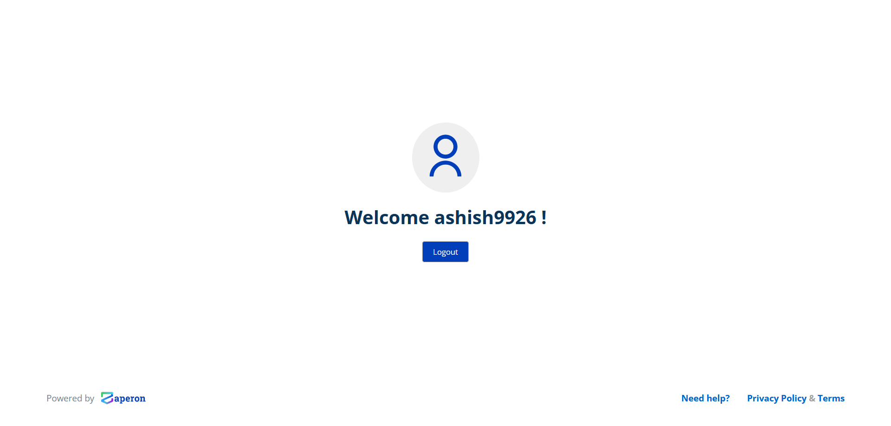

# Finlock Assignment
> This is an assignment by Finlock, where I was expected to make an authentication system (only login and registration) using JWT.
<!-- > Live demo [_here_](https://www.example.com). If you have the project hosted somewhere, include the link here. -->


## Technologies Used
- npm - version 8.15.0
- Mongoose - version 6.8.3
- ExpressJS - version 4.18.2
- React - version 18.2.0
- JWT


## Features
List the ready features here:
- Users can login through the route `/login`
- Users can register through the route `/register`
- Responsive design


## Setup
Make sure that you have npm installed. <br>
To locally install the project,
- clone the project
```
git clone https://github.com/AshishPandagre/finlock__assignment
cd finlock__asignment
```
- download dependencies
```
npm run setup
```
- start backend and frontend servers (Yes, this command will start both your frontend and backend server)
```
npm run dev
```
- By default, Backend will run at port 3000 & frontend will run at 5173
- So, go over to `http://localhost:5173` to view th project.
- Go over to `http://localhost:5173/register` to add a new user to the database.


## Available Routes for Frontend
- `http://localhost:5173` - Frontend base url.
- `/login` - Renders the login page.
- `/register` - Renders the user registration page.
- `/` - Renders the profile page, which shows the username of the logged in user


## Available Routes for Backend
- `http://localhost:3000` - Backend base url.
- `/login` - Supports only `POST` method, and needs two arguments, `username` and `password`, if credentials are valid, a token will be received as a response.
- `/register` - Supports only `POST` method, and needs two arguments, `username` and `password`. (Username should be unique)
- `/` - Supports only `GET` method. This route returns a response only when user is authenticated i.e the request contains a valid token in it's authorization header.
- The default expiry time for a token is 1 minutes, which can be changed from the `.env` file present in `backend` folder. 


## Screenshots


